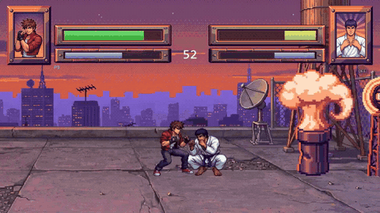
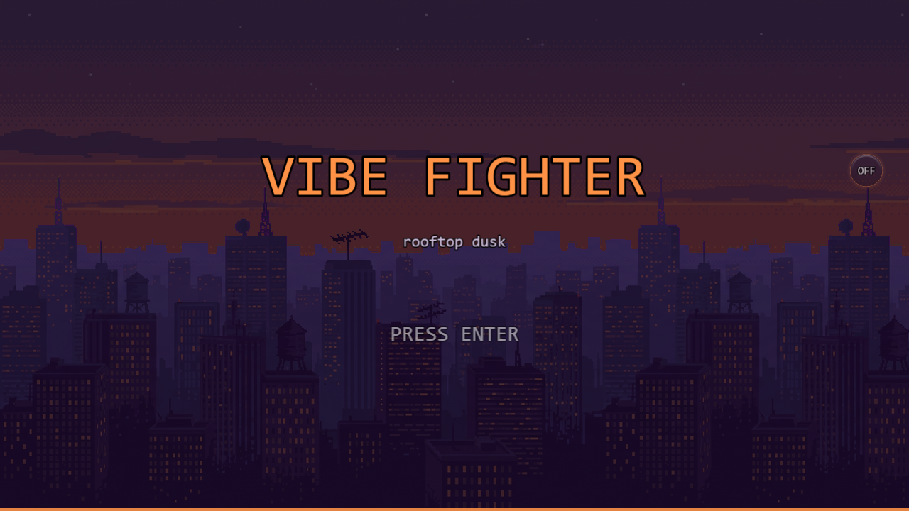
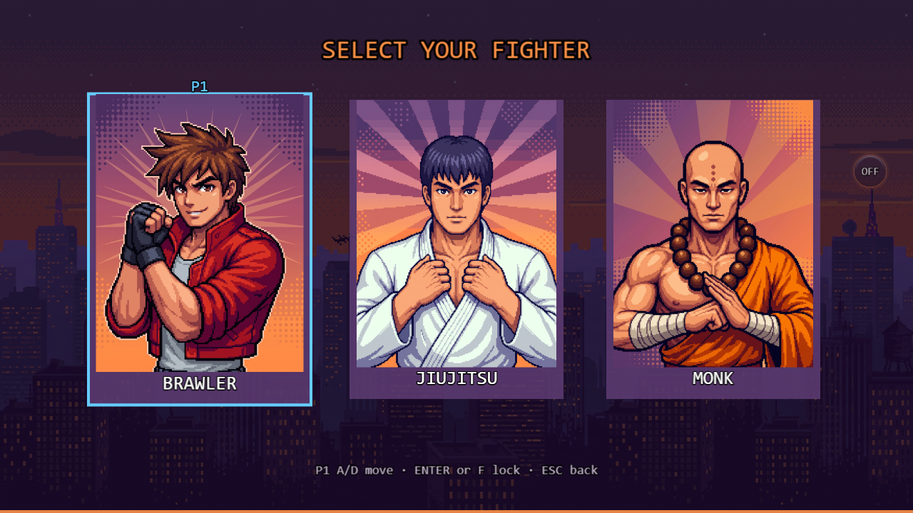
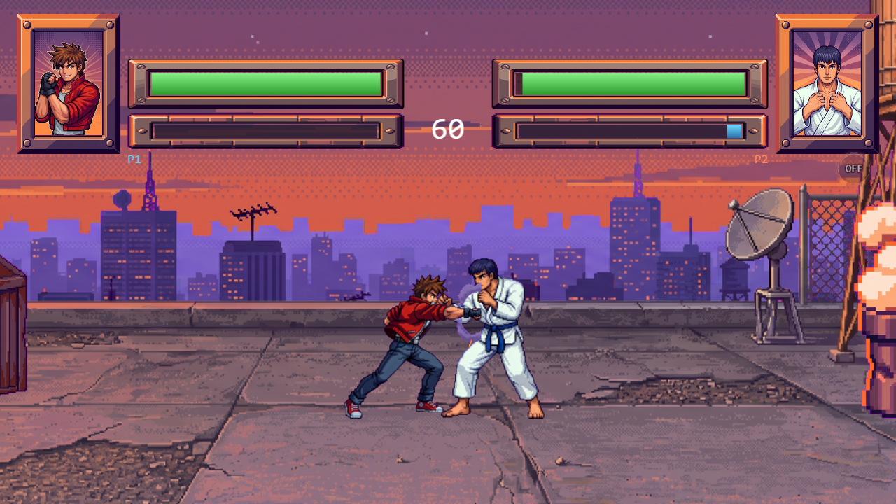
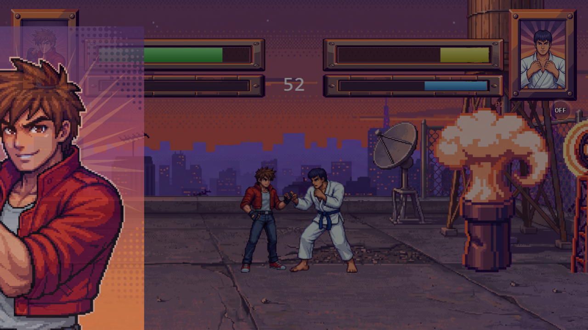

# Vibe Fighter

A local two-player Street Fighter–style game that runs in the browser. Three fighters, two rooftop
stages, best of three. Every sprite, background, portrait and sound in it was generated for it.

**▶ [Play it](https://vibe-fighter-dusky.vercel.app)** — desktop or phone, nothing to install.



---

## What it is

A complete fighting game, not a demo. Two players share one keyboard, or one player takes on the CPU
at easy / normal / hard. Rounds are best-of-three with a 60-second timer.

- **Three fighters** — `brawler`, `jiujitsu`, `monk`. Each has its own light, heavy, crouching and
  air normals, a held guard, and a meter-spending super with a cut-in.
- **Two stages** — `twilight` and `sunset`, eight parallax layers each, with a camera that scrolls
  and zooms a world wider than the viewport.
- **Plays on a phone** — an eight-button touch pad appears automatically on coarse-pointer devices,
  with a rotate gate for portrait.

The art direction is rooftop-dusk. The fighter sprites are video-derived frames and the backgrounds
are painted, so the renderer uses **linear filtering, not `pixelArt`** — nearest-neighbour would
shimmer on every rescale.

<table>
<tr>
<td></td>
<td></td>
</tr>
<tr>
<td></td>
<td></td>
</tr>
</table>

## Controls

Block is a **dedicated key**, not hold-back. Crouching attacks are **lows** — block them crouching.
The super needs a full meter and spends all of it.

| | Player 1 | Player 2 |
| --- | --- | --- |
| Move | `A` `D` | `←` `→` |
| Jump / Crouch | `W` / `S` | `↑` / `↓` |
| Light / Heavy | `F` / `G` | `,` / `.` |
| Block | `Q` | `/` |
| Super | `E` | `M` |

`Enter` confirms in menus, `Esc` goes back (press it twice to quit a match), `N` mutes.

On a touch device the pad replaces all of it, and local 1v1 is hidden — the second fighter is always
the CPU there. Force the pad on or off with `?touch=1` / `?touch=0`, and if something misbehaves on a
particular phone, `?diag=1` shows what the device was classified as. Both flags work in production,
deliberately: device classification can't be reproduced from a dev machine.

## Tech stack

| | |
| --- | --- |
| **Language** | TypeScript 7 (strict, plus `noUnusedLocals` / `noUnusedParameters` / `noImplicitReturns`) |
| **Renderer** | [Phaser 4](https://phaser.io) (`^4.2.1`) — WebGL |
| **Build** | [Vite 8](https://vite.dev) |
| **Tests** | [Vitest](https://vitest.dev) for the simulation, [Playwright](https://playwright.dev) for the render layer |
| **Asset pipeline** | Python (Pillow + numpy) — sprite packing, chroma keying, atlas packing, audio mastering |
| **Hosting** | Vercel |

Runtime dependencies: **Phaser, and nothing else.**

## Run it locally

Node 20.19+ or 22.12+ (Vite 8's floor; production builds on Node 24).

```bash
git clone https://github.com/roiizchak/vibe-fighter.git
cd vibe-fighter
npm install
npm run dev          # http://localhost:5173
```

Other commands:

```bash
npm run build        # BOTH typechecks (browser + tooling), then vite build
npm test             # vitest — the pure simulation, in the node environment
npm run test:e2e     # Playwright — the render layer, in a real browser
npm run preview      # serve the built bundle; the only place the production CSP is testable
npm run demo         # re-record docs/media/demo.mp4 + demo.gif by playing the real game
```

A fresh clone can build, play and test. It **cannot regenerate the art** — the authoring masters
under `concepts/` are gitignored (483 MB that only exist on the author's machine), so the Python
asset scripts have nothing to read. Everything the game actually loads is committed under `public/`.

## How it's built

The one design decision everything else follows from:

> **`src/sim/` is a pure, deterministic 60 Hz simulation that imports no Phaser** — no `Date.now`, no
> `Math.random`, no DOM. Phaser is only a rendering and input adapter bolted on top.

That is why the simulation tests run in Vitest's `node` environment with no browser at all, why the
Playwright suite can step the game frame by frame instead of racing it, and why the CPU can be tuned
by running thousands of headless matches. Timing is in **ticks** (integers at 60 Hz), never
wall-clock seconds; all hit/hurt/guard boxes are **fighter-local** (`+x` = forward, `+y` = up from the
feet).

```
src/
├── sim/       the game — world, fighters, combat, boxes, meter, rounds, CPU. Pure TypeScript.
├── render/    the Phaser adapter — sprites, stage, HUD, camera, audio, touch pad.
├── scenes/    Boot → Flow (title/mode/stage/select) → Match, plus dev-only Gym and Playground.
└── main.ts    the Phaser game config and viewport sizing.
```

473 Vitest tests across 24 files, plus 22 Playwright specs, cover it.

## Documentation

Each of these holds reasoning you can't recover by reading the code:

| | |
| --- | --- |
| [`docs/architecture.md`](docs/architecture.md) | the sim/render boundary |
| [`docs/sim-invariants.md`](docs/sim-invariants.md) | tick order, boxes, attacks, meter, CPU, rounds |
| [`docs/render-notes.md`](docs/render-notes.md) | the Phaser adapter: cameras, viewport, HUD, touch, audio |
| [`docs/testing-and-e2e.md`](docs/testing-and-e2e.md) | the Playwright pump harness and why it exists |
| [`docs/lessons.md`](docs/lessons.md) | the measurement rules and the defects that produced them |
| [`docs/art-pipeline.md`](docs/art-pipeline.md) | generating sprites, stages and audio |
| [`docs/history.md`](docs/history.md) | what shipped when |
| [`docs/phases/`](docs/phases/) | the per-phase specs and gate logs |

## How it was made

Built with [Claude Code](https://claude.com/claude-code) across 23 documented phases, each with a
written spec, a gate, and in most cases an independent QA pass — all of it in
[`docs/phases/`](docs/phases/). [`prompts.pdf`](prompts.pdf) is the original specification the phases
were cut from.

The art and audio were generated too: fighter animations as image-to-video per state, backgrounds and
UI as chroma-keyed layers, and every sound cue synthesized. No asset pack, no stock library, no
royalty-free audio anywhere in it. Per-asset provenance is in
[`docs/asset-manifest.md`](docs/asset-manifest.md).

## License

**Code is [MIT](LICENSE)** — `src/`, `scripts/`, `e2e/`, `vite/`, `docs/` and the root config.

**Art and audio are not.** Everything under `public/` and `concepts/` is proprietary, all rights
reserved. See [ASSETS-LICENSE.md](ASSETS-LICENSE.md). Read the code, run the game, reuse the engine —
but the fighters, stages and sounds stay here.
